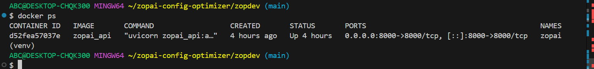

# 🔹 ZopAI Config Optimizer

**AI-powered Helm `values.yaml` analyzer with comprehensive reporting — CLI, REST API, Dockerized & Kubernetes-ready.**

---

## 📌 Overview

ZopAI Config Optimizer is an intelligent analysis tool that scans Helm `values.yaml` files, detects common misconfigurations, and auto-generates **optimized configs** with **detailed multi-format reports**. It combines rule-based analysis with AI-powered suggestions to help developers & DevOps teams deploy **safer, cost-efficient, and reliable Kubernetes applications**.

This project is built as part of **Zopdev Summer of Code 2025 (Track 1: AI Agents)**.

---

## ✨ Features

### 🔍 **Smart Analysis**
- Detects insecure configurations (`runAsRoot`, missing RBAC)
- Ensures proper CPU/Memory limits & requests
- Validates liveness/readiness probes
- AI-powered suggestions using Google Gemini
- Configurable health scoring system

### 📊 **Multi-Format Reporting**
- **Text Reports** - Human-readable analysis summaries
- **PDF Reports** - Professional formatted documents with tables
- **HTML Reports** - Interactive web-based reports
- **Optimized YAML** - Auto-corrected configuration files

### 🚀 **Deployment Options**
- **CLI Mode** - Direct command-line analysis
- **REST API** - FastAPI with Swagger UI documentation
- **Docker Support** - Containerized deployment
- **Kubernetes Ready** - Complete K8s manifests included

### 📥 **File Management**
- Upload `values.yaml` files via API
- Download all generated reports and optimized configs
- Structured output directory organization

---

## 🏗️ Project Structure

```
zopai-config-optimizer/
├── analyzer.py              # Core analysis engine with rule-based checks
├── zopai_api.py            # FastAPI server with upload/download endpoints
├── test_analyzer.py        # CLI testing interface
├── report_generator.py     # PDF and HTML report generation
├── values.yaml             # Sample input configuration
├── outputs/                # Generated analysis results
│   ├── optimized_values.yaml
│   ├── analysis_report.txt
│   ├── analysis_report.pdf
│   └── analysis_report.html
├── screenshots/            # Documentation screenshots
│   ├── docker_ps.png
│   ├── html_report.png
│   ├── pdf_report.png
│   └── swagger_ui.png
├── requirements.txt        # Python dependencies
├── Dockerfile              # Container configuration
├── .dockerignore          # Docker build exclusions
└── k8s/                   # Kubernetes deployment manifests
    ├── deployment.yaml
    └── service.yaml
```

---

## 🚀 Getting Started & Testing

### Prerequisites
- Python 3.8+ installed
- Git installed
- (Optional) Docker installed for containerized deployment
- (Optional) Google API Key for AI recommendations

### 📦 Installation

1. **Clone the repository:**
```bash
git clone https://github.com/roy-sid/zopdev.git
cd zopdev
cd agents/zopai-config-optimizer
```

2. **Install Python dependencies:**
```bash
pip install -r requirements.txt
```

3. **Set up AI recommendations:**
```bash
# Linux/macOS
export GOOGLE_API_KEY=YOUR_GOOGLE_API_KEY_HERE

# Windows CMD
set GOOGLE_API_KEY=YOUR_GOOGLE_API_KEY_HERE

# Windows PowerShell
$env:GOOGLE_API_KEY="YOUR_GOOGLE_API_KEY_HERE"
```

---

### 🧪 Testing the Application

#### **Method 1: CLI Mode Testing**

**Test with the provided sample file:**
```bash
# Run analysis on the included values.yaml sample
python test_analyzer.py
```

**Expected Output:**
```
✅ Analysis complete!
📁 Generated files in outputs/:
  - optimized_values.yaml (Auto-corrected config)
  - analysis_report.txt (Detailed analysis)
  - analysis_report.pdf (Professional PDF report)
  - analysis_report.html (Interactive web report)

Config Health Score: XX/100
```

**Verify generated files:**
```bash
ls -la outputs/
cat outputs/analysis_report.txt
```

#### **Method 2: API Mode Testing**

**Step 1: Start the FastAPI server**
```bash
uvicorn zopai_api:app --reload
```

**Step 2: Open Swagger UI in browser**
```
http://127.0.0.1:8000/docs
```

**Step 3: Test via curl commands**
```bash
# Upload and analyze the sample values.yaml
curl -X POST "http://127.0.0.1:8000/analyze" \
     -H "accept: application/json" \
     -H "Content-Type: multipart/form-data" \
     -F "file=@values.yaml"

# Download the optimized configuration
curl -X GET "http://127.0.0.1:8000/download/optimized" \
     --output test_optimized_values.yaml

# Download text report
curl -X GET "http://127.0.0.1:8000/download/report" \
     --output test_analysis_report.txt

# Download PDF report
curl -X GET "http://127.0.0.1:8000/download/pdf" \
     --output test_analysis_report.pdf

# Download HTML report
curl -X GET "http://127.0.0.1:8000/download/html" \
     --output test_analysis_report.html
```

**Step 4: Test with your own values.yaml**
```bash
# Replace 'your-values.yaml' with your actual file
curl -X POST "http://127.0.0.1:8000/analyze" \
     -F "file=@your-values.yaml"
```

#### **Method 3: Docker Testing**

**Step 1: Build the Docker image**
```bash
docker build -t zopai-config-optimizer .
```

**Step 2: Run the container**
```bash
docker run -d -p 8000:8000 --name zopai-test zopai-config-optimizer
```

**Step 3: Verify the container is running**
```bash
docker ps
```

**Step 4: Test the dockerized API**
```bash
# Test health endpoint
curl http://localhost:8000/

# Upload sample file to dockerized instance
curl -X POST "http://localhost:8000/analyze" \
     -F "file=@values.yaml"
```

**Step 5: Clean up**
```bash
docker stop zopai-test
docker rm zopai-test
```

#### **Method 4: Kubernetes Testing**

**Prerequisites:** kubectl configured with access to a Kubernetes cluster

**Step 1: Update the image in deployment.yaml**
```bash
# Edit k8s/deployment.yaml and replace image with your registry
# Example: your-registry/zopai-config-optimizer:latest
```

**Step 2: Build and push to your registry**
```bash
docker tag zopai-config-optimizer <your-registry>/zopai-config-optimizer:latest
docker push <your-registry>/zopai-config-optimizer:latest
```

**Step 3: Deploy to Kubernetes**
```bash
kubectl apply -f k8s/deployment.yaml
kubectl apply -f k8s/service.yaml
```

**Step 4: Verify deployment**
```bash
kubectl get pods
kubectl get services
```

**Step 5: Test the service**
```bash
# Get the NodePort
kubectl get service zopai-config-optimizer-service

# Test via NodePort (replace <node-ip> and <node-port>)
curl -X POST "http://<node-ip>:<node-port>/analyze" \
     -F "file=@values.yaml"
```

---

### 🧪 Creating Your Own Test Cases

**Create a test values.yaml with intentional issues:**
```yaml
# test-insecure-values.yaml
securityContext:
  runAsUser: 0              # Security issue: running as root
  
rbac:
  create: false             # Security issue: RBAC disabled

replicaCount: 1
image:
  repository: nginx
  tag: latest

# Missing: resource limits, health probes
```

**Test this file:**
```bash
# CLI mode
cp test-insecure-values.yaml values.yaml
python test_analyzer.py

# API mode
curl -X POST "http://127.0.0.1:8000/analyze" \
     -F "file=@test-insecure-values.yaml"
```

---

### 🔍 Expected Test Results

When testing with the provided sample or an insecure configuration, you should see:

**1. Analysis Report showing warnings like:**
```
WARNING! runAsRoot detected
WARNING! Missing resource limits
WARNING! Missing health probes
WARNING! RBAC disabled
```

**2. Optimized values.yaml with fixes:**
```yaml
securityContext:
  runAsUser: 1000
  runAsNonRoot: true
resources:
  limits:
    cpu: 500m
    memory: 512Mi
  requests:
    cpu: 250m
    memory: 256Mi
livenessProbe:
  httpGet:
    path: /
    port: 80
readinessProbe:
  httpGet:
    path: /
    port: 80
rbac:
  create: true
```

**3. Health Score:** Should be less than 100 for configs with issues, 100 for optimal configs.

**4. AI Recommendations:** (If GOOGLE_API_KEY is set) Context-aware suggestions for improvements.

---

### 🐛 Troubleshooting

**Common Issues and Solutions:**

| Issue | Solution |
|-------|----------|
| `ModuleNotFoundError` | Run `pip install -r requirements.txt` |
| `Port 8000 already in use` | Use `uvicorn zopai_api:app --port 8001` |
| `Permission denied` on Docker | Use `sudo docker` or add user to docker group |
| `AI suggestions not working` | Ensure `GOOGLE_API_KEY` environment variable is set |
| `outputs/ directory not created` | Run CLI mode first: `python test_analyzer.py` |

**Debug mode:**
```bash
# Run with verbose output
uvicorn zopai_api:app --reload --log-level debug
```

---

## 🤖 Enable AI Recommendations

To activate AI-based suggestions in ZopAI Config Optimizer, follow these steps:

### 1. Set your Google API Key

Set your Google API Key in the terminal before running the server:

**Linux/macOS:**
```bash
export GOOGLE_API_KEY=YOUR_KEY_HERE
```

**Windows CMD:**
```cmd
set GOOGLE_API_KEY=YOUR_KEY_HERE
```

**Windows PowerShell:**
```powershell
$env:GOOGLE_API_KEY="YOUR_KEY_HERE"
```

### 2. Start the FastAPI server:
```bash
uvicorn zopai_api:app --reload
```

### 3. Open Swagger UI in your browser:
```
http://127.0.0.1:8000/docs
```

### 4. Test the endpoints
Upload your `values.yaml` or send JSON. AI recommendations will now appear in the response.

⚠️ **Important Note:** If the `GOOGLE_API_KEY` is not set, AI suggestions will be disabled, but all other optimization features will still work.

---

## 🌐 **API Reference**

```bash
# Start the FastAPI server
uvicorn zopai_api:app --reload
```

**Access Swagger UI:** 👉 [http://127.0.0.1:8000/docs](http://127.0.0.1:8000/docs)

### 📡 **API Endpoints**

| Method | Endpoint | Description |
|--------|----------|-------------|
| `POST` | `/analyze` | Upload `values.yaml` and get complete analysis |
| `GET` | `/download/optimized` | Download optimized YAML file |
| `GET` | `/download/report` | Download text report |
| `GET` | `/download/pdf` | Download PDF report |
| `GET` | `/download/html` | Download HTML report |

### 📝 **API Usage Example**

```bash
# Upload and analyze values.yaml file
curl -X POST "http://127.0.0.1:8000/analyze" \
     -F "file=@values.yaml"

# Download optimized configuration
curl -X GET "http://127.0.0.1:8000/download/optimized" \
     -o optimized_values.yaml
```

---

## 💡 Example Analysis

### **Input** (`values.yaml`)
```yaml
securityContext:
  runAsUser: 0   # Insecure: running as root

rbac:
  create: false  # Missing RBAC

# Missing: resource limits, health probes
```

### **Output** (`optimized_values.yaml`)
```yaml
securityContext:
  runAsUser: 1000
  runAsNonRoot: true
resources:
  limits:
    cpu: 500m
    memory: 512Mi
  requests:
    cpu: 250m
    memory: 256Mi
livenessProbe:
  httpGet:
    path: /
    port: 80
  initialDelaySeconds: 10
  periodSeconds: 5
readinessProbe:
  httpGet:
    path: /
    port: 80
  initialDelaySeconds: 10
  periodSeconds: 5
rbac:
  create: true
```

### **Analysis Report**
```
ZopAI Config Optimizer Report
========================================

Config Health Score: 50/100

WARNING! runAsRoot detected -> set runAsNonRoot=true, runAsUser=1000
WARNING! Resources: Missing CPU/memory -> added default requests/limits
WARNING! Missing livenessProbe -> added HTTP probe
WARNING! Missing readinessProbe -> added HTTP probe
WARNING! RBAC disabled -> set rbac.create=true

---

AI-based Suggestions:
[Gemini AI provides context-aware optimization recommendations]
```

---

## 🔧 Configuration

### **Environment Variables**
```bash
# Required for AI suggestions
export GOOGLE_API_KEY="your-gemini-api-key"
```

### **Health Scoring**
- **Base Score:** 100 points
- **Penalty:** -10 points per detected warning
- **Minimum:** 0 points

## 📂 **Outputs** → [outputs/](outputs/)  
Contains all optimized values and generated reports (HTML + PDF)

---

## 📸 Screenshots

### Docker Containers


### HTML Report


### PDF Report


### Swagger UI


---

## 🛡️ Security Checks

| Check | Description | Auto-Fix |
|-------|-------------|----------|
| **Root User** | Detects `runAsUser: 0` | Sets `runAsUser: 1000` + `runAsNonRoot: true` |
| **RBAC** | Validates role-based access | Enables `rbac.create: true` |
| **Resource Limits** | Ensures CPU/memory constraints | Adds default limits/requests |
| **Health Probes** | Validates liveness/readiness | Adds HTTP probes on port 80 |

---

## 📋 Dependencies

```txt
fastapi==0.116.1           # REST API framework
pydantic==2.11.7           # Data validation
PyYAML==6.0.2             # YAML processing
uvicorn==0.35.0           # ASGI server
jinja2==3.1.4             # HTML templating
reportlab==4.2.2          # PDF generation
python-multipart==0.0.9   # File upload support
google-generativeai==0.8.5 # AI suggestions
```

---

## 🤝 Contributing

1. Fork the repository
2. Create a feature branch (`git checkout -b feature/amazing-feature`)
3. Commit your changes (`git commit -m 'Add amazing feature'`)
4. Push to the branch (`git push origin feature/amazing-feature`)
5. Open a Pull Request

---


## 👨‍💻 Author

**Siddhant Roy**
- GitHub: [@roy-sid](https://github.com/roy-sid)
- Project: Zopdev Summer of Code 2025 (Track 1: AI Agents)
- Email: roysiddhant2003@gmail.com

---

