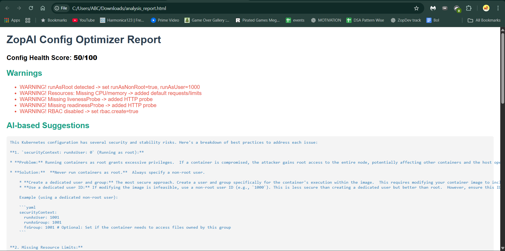

# 🔹 ZopAI Config Optimizer

**AI-powered Helm `values.yaml` analyzer with comprehensive reporting — CLI, REST API, Dockerized & Kubernetes-ready.**

---

## 📌 Overview

ZopAI Config Optimizer is an intelligent analysis tool that scans Helm `values.yaml` files, detects common misconfigurations, and auto-generates **optimized configs** with **detailed multi-format reports**. It combines rule-based analysis with AI-powered suggestions to help developers & DevOps teams deploy **safer, cost-efficient, and reliable Kubernetes applications**.

This project is built as part of **Zopdev Summer of Code 2025 (Track 1: AI Agents)**.

---

## ✨ Features

### 🔍 **Smart Analysis**
- Detects insecure configurations (`runAsRoot`, missing RBAC)
- Ensures proper CPU/Memory limits & requests
- Validates liveness/readiness probes
- AI-powered suggestions using Google Gemini
- Configurable health scoring system

### 📊 **Multi-Format Reporting**
- **Text Reports** - Human-readable analysis summaries
- **PDF Reports** - Professional formatted documents with tables
- **HTML Reports** - Interactive web-based reports
- **Optimized YAML** - Auto-corrected configuration files

### 🚀 **Deployment Options**
- **CLI Mode** - Direct command-line analysis
- **REST API** - FastAPI with Swagger UI documentation
- **Docker Support** - Containerized deployment
- **Kubernetes Ready** - Complete K8s manifests included

### 📥 **File Management**
- Upload `values.yaml` files via API
- Download all generated reports and optimized configs
- Structured output directory organization

---

## 🏗️ Project Structure

```
zopai-config-optimizer/
├── analyzer.py              # Core analysis engine with rule-based checks
├── zopai_api.py            # FastAPI server with upload/download endpoints
├── test_analyzer.py        # CLI testing interface
├── report_generator.py     # PDF and HTML report generation
├── values.yaml             # Sample input configuration
├── outputs/                # Generated analysis results
│   ├── optimized_values.yaml
│   ├── analysis_report.txt
│   ├── analysis_report.pdf
│   └── analysis_report.html
├── requirements.txt        # Python dependencies
├── Dockerfile              # Container configuration
├── .dockerignore          # Docker build exclusions
└── k8s/                   # Kubernetes deployment manifests
    ├── deployment.yaml
    └── service.yaml
```

---

## 🚀 Quick Start

### 🔧 **CLI Mode**

```bash
# Install dependencies
pip install -r requirements.txt

# Run analysis on sample config
python test_analyzer.py
```

**Generates:**
- `optimized_values.yaml` - Auto-corrected configuration
- `analysis_report.txt` - Detailed analysis summary

### 🌐 **API Mode**

```bash
# Start the FastAPI server
uvicorn zopai_api:app --reload
```

**Access Swagger UI:** 👉 [http://127.0.0.1:8000/docs](http://127.0.0.1:8000/docs)

### 📡 **API Endpoints**

| Method | Endpoint | Description |
|--------|----------|-------------|
| `POST` | `/analyze` | Upload `values.yaml` and get complete analysis |
| `GET` | `/download/optimized` | Download optimized YAML file |
| `GET` | `/download/report` | Download text report |
| `GET` | `/download/pdf` | Download PDF report |
| `GET` | `/download/html` | Download HTML report |

### 🐳 **Docker Deployment**

```bash
# Build image
docker build -t zopai-config-optimizer .

# Run container
docker run -d -p 8000:8000 zopai-config-optimizer
```

### ☸️ **Kubernetes Deployment**

```bash
# Build and push to registry
docker tag zopai-config-optimizer <your-registry>/zopai-config-optimizer:latest
docker push <your-registry>/zopai-config-optimizer:latest

# Deploy to cluster
kubectl apply -f k8s/deployment.yaml
kubectl apply -f k8s/service.yaml

# Access via NodePort
# http://<node-ip>:30080/docs
```

---

##  Example Analysis

### **Input** (`values.yaml`)
```yaml
securityContext:
  runAsUser: 0   # Insecure: running as root

rbac:
  create: false  # Missing RBAC

# Missing: resource limits, health probes
```

### **Output** (`optimized_values.yaml`)
```yaml
securityContext:
  runAsUser: 1000
  runAsNonRoot: true
resources:
  limits:
    cpu: 500m
    memory: 512Mi
  requests:
    cpu: 250m
    memory: 256Mi
livenessProbe:
  httpGet:
    path: /
    port: 80
  initialDelaySeconds: 10
  periodSeconds: 5
readinessProbe:
  httpGet:
    path: /
    port: 80
  initialDelaySeconds: 10
  periodSeconds: 5
rbac:
  create: true
```

### **Analysis Report**
```
ZopAI Config Optimizer Report
========================================

Config Health Score: 50/100

WARNING! runAsRoot detected -> set runAsNonRoot=true, runAsUser=1000
WARNING! Resources: Missing CPU/memory -> added default requests/limits
WARNING! Missing livenessProbe -> added HTTP probe
WARNING! Missing readinessProbe -> added HTTP probe
WARNING! RBAC disabled -> set rbac.create=true

---

AI-based Suggestions:
[Gemini AI provides context-aware optimization recommendations]
```

---

## 🔧 Configuration

### **Environment Variables**
```bash
# Required for AI suggestions
export GOOGLE_API_KEY="your-gemini-api-key"
```

### **Health Scoring**
- **Base Score:** 100 points
- **Penalty:** -10 points per detected warning
- **Minimum:** 0 points

---

📂 **Outputs** → [outputs/](outputs/)  
Contains all optimized values and generated reports (HTML + PDF)

---
## 📸 Screenshots

### Docker Containers


### HTML Report


### PDF Report


### Swagger UI
`

---

## 🛡️ Security Checks

| Check | Description | Auto-Fix |
|-------|-------------|----------|
| **Root User** | Detects `runAsUser: 0` | Sets `runAsUser: 1000` + `runAsNonRoot: true` |
| **RBAC** | Validates role-based access | Enables `rbac.create: true` |
| **Resource Limits** | Ensures CPU/memory constraints | Adds default limits/requests |
| **Health Probes** | Validates liveness/readiness | Adds HTTP probes on port 80 |

---

## 📋 Dependencies

```txt
fastapi==0.116.1           # REST API framework
pydantic==2.11.7           # Data validation
PyYAML==6.0.2             # YAML processing
uvicorn==0.35.0           # ASGI server
jinja2==3.1.4             # HTML templating
reportlab==4.2.2          # PDF generation
python-multipart==0.0.9   # File upload support
google-generativeai==0.8.5 # AI suggestions
```

---

## 🤝 Contributing

1. Fork the repository
2. Create a feature branch (`git checkout -b feature/amazing-feature`)
3. Commit your changes (`git commit -m 'Add amazing feature'`)
4. Push to the branch (`git push origin feature/amazing-feature`)
5. Open a Pull Request

---

## 📄 License

This project is part of **Zopdev Summer of Code 2025** and follows the program's licensing terms.

---

## 👨‍💻 Author

**Siddhant Roy**
- GitHub: [@roy-sid](https://github.com/roy-sid)
- Project: Zopdev Summer of Code 2025 (Track 1: AI Agents)
- Email: roysiddhant2003@gmail.com

---

## 🎯 Roadmap

- [ ] Support for multiple YAML file analysis
- [ ] Custom rule configuration
- [ ] Integration with popular CI/CD pipelines
- [ ] Advanced security vulnerability scanning
- [ ] Helm chart validation
- [ ] Multi-cloud provider optimizations

---


---
✅ Integrated with Zopdev platform (Summer of Code 2025)
